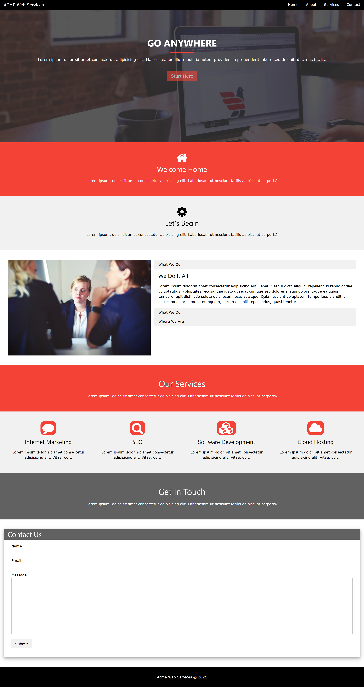

# Responsive Website With The W3 CSS Framework

### About

In this project we focus on the the fundamentals of the W3 CSS Framework, which is similar to other CSS frameworks such as Bootstrap. Utilizing its features, we built a mock web services company.

